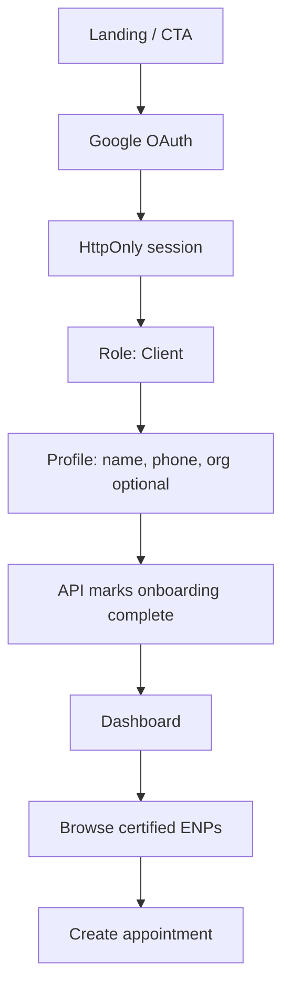
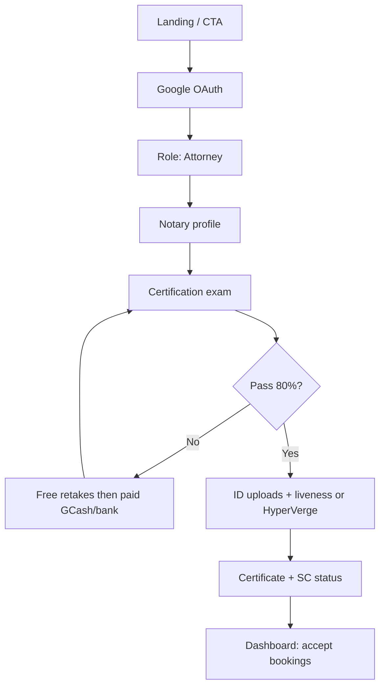

# Quanby Legal (LegalAI) — Onboarding product overview

This document describes onboarding for **two user types** as implemented in the **Quanby Legal** reference stack (`quanby-legal-v2`: FastAPI + static onboarding; production links such as `legal.quanbyai.com` appear in email templates). It also notes how **qlegal-new** relates at the end.

**Regulatory context:** Philippine electronic notarization (IBP roll, notary commission, Supreme Court rules). There is **no Brazil OAB** verification in this codebase; attorney verification is Philippine-style professional fields plus KYC.

---

## Client onboarding

1. **Entry point** — Marketing landing (`index.html` / site home), CTA into **Google OAuth** (`/api/auth/providers` → `/api/auth/callback/google`). Redirect to frontend includes `?step=` with persisted `onboarding_step` (new users: `role_select`).

2. **Account creation** — **Google OAuth** supplies email, names, picture, `email_verified`. Sessions use **HttpOnly JWT cookies** (`ql_access` + refresh). No password, phone OTP, or additional social providers in backend.

3. **Identity / KYC** — **Not required** on the client signup path in API: after profile, `onboarding_step` is set to `certified` for `role === "client"`. Clients do not run certification exam, ID upload, liveness, or HyperVerge during account creation. (Face verification may apply later at **session join** per product/course copy, not in client onboarding API.)

4. **Profile setup** — **Required:** `first_name`, `last_name`, `phone`, `role` (`client`). **Optional:** `prefix`, `middle_initial`, `suffix`, `organization`, `position`. No practice-area or case-type taxonomy at onboarding; intake happens at **booking**.

5. **Matching / intake** — **No algorithmic matching.** `GET /api/enps` lists certified attorneys; `POST /api/appointments` with `enp_id`, `notarization_type` (e.g. ACKNOWLEDGMENT, JURAT), `mode` (`REN` | `IEN`), `notes`, `title`, `preferred_time`.

6. **Payment / contract** — **None** at client signup. Appointments may later reference **Doconchain** (`doconchain_project_uuid`, `doconchain_sign_link`). **₱500 retake fee** is for **failed ENP exams**, not clients.

7. **First action** — Dashboard → pick ENP → **pending appointment**, or **QuickSign** / other flows as exposed in UI.

8. **Notifications** — **Welcome email** on first login (`onboarding_step === role_select`) via Gmail SMTP (`email_service.py`). **No** exam-fail email for clients. **No SMS/push** in repo.

9. **Drop-off** — OAuth abandon; role confusion; profile friction; expectation of auto-match vs **directory** browsing; later session **camera** denial if applicable.

10. **Tech hints** — Google OAuth + JWT cookies; HyperVerge used on **ENP** path; retakes **GCash/bank + manual admin confirm**; Doconchain on appointments; SMTP (Gmail).

---

## ENP onboarding

*(ENP = Electronic Notary Public; role `attorney` in API.)*

1. **Entry point** — Same as clients: landing → **Google OAuth** → resume via `?step=`.

2. **Account creation** — Same **Google OAuth** + cookies; welcome email on first login.

3. **Identity / KYC** — After **passing certification exam**: government ID (`/api/onboarding/kyc-id`), national ID upload (`/api/onboarding/national-id`), webcam selfie (`/api/onboarding/liveness`), and/or **HyperVerge Web SDK** (`hyperverge-token` → `hyperverge-complete`). Profile captures **roll, commission, PTR, IBP, notary address, MCLE**, etc. (`ProfileRequest` in `main.py`).

4. **Profile setup** — Full attorney profile (structured optional strings in API; compliance narrative expects completeness). `PATCH /api/profile` supports ongoing edits including `npn`.

5. **Matching / intake** — ENPs are **listed** when `certificate_status === certified`; clients choose by `enp_id`.

6. **Payment / contract** — **Exam retakes:** three free failures then **₱500** via **GCash or bank transfer**; `retake_payment_pending` until admin sets `retake_payment_confirmed`. No card gateway in code.

7. **First action** — Pass exam → complete KYC path → **download certificate** → track **SC commission** (`sc_commission_status`); dashboard for **confirm/decline appointments**, QuickSign, etc.

8. **Notifications** — Welcome email with course PDF + exam + SC steps; **test-fail email** with score; retake messages reference email when payment verified. No SMS/push.

9. **Drop-off** — Exam difficulty/time; retake **payment wait**; HyperVerge cancel/SDK errors; camera/ID upload; long forms; SC submission uncertainty.

10. **Tech hints** — Same auth; **HyperVerge** for identity; files on disk under `backend/data/`; SQLite user store; Gmail SMTP.

---

## Key differences

| Dimension | Client | ENP |
|-----------|--------|-----|
| Entry | Google from landing | Same |
| Profile | Light | Heavy (commission, IBP, PTR, MCLE, addresses) |
| Certification exam | No | Yes (15 shown / 50 pool, 80%, time limit) |
| KYC at signup | No (API) | Yes |
| Certificate | N/A (verified client wording in cert generator for role) | ENP certificate ID + HTML |
| Payments at signup | None | Retake fee after free attempts |
| Routing | Client picks ENP | Listed when certified |

---

## Recommendations for qlegal-new

1. **Single source of truth for steps** — `deriveOnboardingStep` in `apps/backend/src/modules/v1/auth-profile/auth-profile.service.ts` already drives `onboardingStep`; align wizard copy with concrete next actions (deep links), not only “open dashboard.”

2. **Client KYC policy** — If trust or remote notarization requires it, add an explicit **client** identity step in contracts and UI; do not rely on ENP-only HyperVerge.

3. **Automated retake payments** — If porting paid exam retakes, use a **payment provider + webhook** instead of manual GCash/bank + admin flag.

4. **Resume UX** — Keep server-driven `onboardingStep` (and optional `OnboardingProgress` from oRPC) as the resume contract across web and mobile.

5. **Transactional comms** — Add email (and optional SMS) on step transitions for certification/KYC, mirroring Quanby welcome/fail patterns.

---

*Sources: `quanby-legal-v2/backend/main.py`, `onboarding.py`, `email_service.py`, `onboard.html`; `qlegal-new` — `auth-profile.service.ts`, `real-onboarding-flow.tsx`.*
